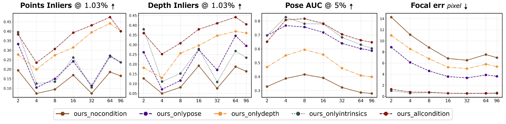

[English Version](README.md)
# **HunyuanWorld-Mirror**

<p align="center">
  
</p>

<p align="center">
<a href='https://3d-models.hunyuan.tencent.com/world/'></a>
<a href='https://3d-models.hunyuan.tencent.com/world/worldMirror1_0/HYWorld_Mirror_Tech_Report.pdf'></a>
<a href='https://huggingface.co/tencent/HunyuanWorld-Mirror'></a>
<a href='https://huggingface.co/spaces/tencent/HunyuanWorld-Mirror'></a>
<a href=https://discord.gg/dNBrdrGGMa target="_blank"></a>
  <a href=https://x.com/TencentHunyuan target="_blank"></a>
<p align="center">


HunyuanWorld-Mirror 是一个多功能的前馈模型，用于全面的3D几何预测。它整合了多种几何先验（**相机位姿**、**校准内参**、**深度图**），并在单次前向传播中同时生成各种3D表示（**点云**、**多视图深度**、**相机参数**、**表面法线**、**3D高斯**）。


https://github.com/user-attachments/assets/ced3ef9e-8f90-423f-8ad0-ada9069111d6


## 🔥🔥🔥 更新
* **[2025年10月22日]**：我们发布了推理代码和模型权重。[下载](https://huggingface.co/tencent/HunyuanWorld-Mirror)。

> 加入我们的 **[微信群](#)** 和 **[Discord](https://discord.gg/dNBrdrGGMa)** 群组，与我们讨论并获得帮助。

| 微信群                                     | 小红书                                           | X                                           | Discord                                           |
|--------------------------------------------------|-------------------------------------------------------|---------------------------------------------|---------------------------------------------------|
|  |  |  |  | 


## ☯️ **HunyuanWorld-Mirror 介绍**

### 架构
HunyuanWorld-Mirror 由两个关键组件组成：

**(1) 多模态先验提示**：一种将多种先验模态（包括校准内参、相机位姿和深度）嵌入到前馈模型中的机制。给定任何可用先验的子集，我们利用几个轻量级编码层将每种模态转换为结构化的token。

**(2) 通用几何预测**：一个统一的架构，能够处理从相机和深度估计到点图回归、表面法线估计和新视图合成的全方位3D重建任务。

<p align="left">
  
</p>


## 🛠️ 依赖和安装
我们建议使用 CUDA 12.4 版本进行手动安装。
```shell
# 1. 克隆仓库
git clone https://github.com/Tencent-Hunyuan/HunyuanWorld-Mirror
cd HunyuanWorld-Mirror

# 2. 创建 conda 环境
conda create -n hunyuanworld-mirror python=3.10 cmake=3.14.0 -y
conda activate hunyuanworld-mirror

# 3. 使用 conda 安装 PyTorch 和其他依赖
# 对于 CUDA 12.4
conda install pytorch=2.4.0 torchvision pytorch-cuda=12.4 nvidia/label/cuda-12.4.0::cuda-toolkit -c pytorch -c nvidia -y

# 4. 安装 pip 依赖
pip install -r requirements.txt

# 5. 安装 gsplat 用于 3D 高斯点云渲染
# 对于 CUDA 12.4
pip install gsplat --index-url https://docs.gsplat.studio/whl/pt24cu124
```

## 🎮 快速开始
我们提供了一个 Gradio 演示，用于快速体验 HunyuanWorld-Mirror 模型。

<p align="center">
  
</p>

### 在线演示
无需安装即可试用我们的在线演示：[🤗 Hugging Face 演示](https://huggingface.co/spaces/tencent/HunyuanWorld-Mirror)

### 本地演示
```shell
# 1. 安装 gradio 演示所需的依赖
pip install -r requirements_demo.txt
# 对于 Windows 系统,请将 onnxruntime 和 gsplat 替换为 Windows 版本的 wheel 包(详见 requirements_demo.txt 中的注释)
# 2. 在本地启动 gradio 演示
python app.py
```

## 📦 下载预训练模型
要下载 HunyuanWorld-Mirror 模型，首先安装 huggingface-cli：
```
python -m pip install "huggingface_hub[cli]"
```
然后使用以下命令下载模型：
```
huggingface-cli download tencent/HunyuanWorld-Mirror --local-dir ./ckpts
```
> **注意**：对于推理，模型权重将在运行推理脚本时自动从 Hugging Face 下载，因此如果愿意，您可以跳过此手动下载步骤。

## 🚀 使用图像和先验进行推理
### 示例代码片段
```python
from pathlib import Path
import torch
from src.models.models.worldmirror import WorldMirror
from src.utils.inference_utils import extract_load_and_preprocess_images

# --- Setup ---
device = 'cuda' if torch.cuda.is_available() else 'cpu'
model = WorldMirror.from_pretrained("tencent/HunyuanWorld-Mirror").to(device)

# --- Load Data ---
# Load a sequence of N images into a tensor
inputs = {}
inputs['img'] = extract_load_and_preprocess_images(
    Path("path/to/your/data"), # video or directory containing images 
    fps=1, # fps for extracing frames from video
    target_size=518
).to(device)  # [1,N,3,H,W], in [0,1]

# -- Load Priors (Optional) --
# Configure conditioning flags and prior paths
cond_flags = [0, 0, 0]  # [camera_pose, depth, intrinsics]
prior_data = {
    'camera_pose': None,      # Camera pose tensor [1, N, 4, 4]
    'depthmap': None,         # Depth map tensor [1, N, H, W]
    'camera_intrinsics': None # Camera intrinsics tensor [1, N, 3, 3]
}
for idx, (key, data) in enumerate(prior_data.items()):
    if data is not None:
        cond_flags[idx] = 1
        inputs[key] = data

# --- Inference ---
with torch.no_grad():
    predictions = model(views=inputs, cond_flags=cond_flags)
```

<details>
<summary>点击查看输出格式</summary>

```python
# 几何输出
pts3d_preds, pts3d_conf = predictions["pts3d"][0], predictions["pts3d_conf"][0]      # 世界坐标系中的3D点云：[S, H, W, 3], 点云置信度: [S, W, H] 
depth_preds, depth_conf = predictions["depth"][0], predictions["depth_conf"][0]      # 相机坐标系中的Z深度：[S, H, W, 1], 深度置信度: [S, W, H] 
normal_preds, normal_conf = predictions["normals"][0], predictions["normals_conf"][0] # 相机坐标系中的表面法线：[S, H, W, 3], 法线置信度: [S, W, H] 

# 相机输出
camera_poses = predictions["camera_poses"][0]  # 相机到世界的位姿（OpenCV约定）：[S, 4, 4]
camera_intrs = predictions["camera_intrs"][0]  # 相机内参矩阵：[S, 3, 3]
camera_params = predictions["camera_params"][0]   # 相机向量：[S, 9]（平移，旋转四元数，fov_v，fov_u）

# 3D 高斯点云输出
splats = predictions["splats"]
means = splats["means"][0].reshape(-1, 3)      # 高斯均值：[N, 3]
opacities = splats["opacities"][0].reshape(-1) # 高斯不透明度：[N]
scales = splats["scales"][0].reshape(-1, 3)    # 高斯尺度：[N, 3]
quats = splats["quats"][0].reshape(-1, 4)      # 高斯四元数：[N, 4]
sh = splats["sh"][0].reshape(-1, 1, 3)         # 高斯球谐函数：[N, 1, 3]
```

其中：
- `S` 是输入视图的数量
- `H, W` 是输入图像的高度和宽度
- `N` 是3D高斯的数量

</details>


### 更多功能的推理

对于高级用法，请参阅 `infer.py`，它提供了额外的功能：
- 保存预测：点云、深度图、法线、相机参数和3D高斯点云
- 可视化输出：深度图、表面法线和3D点云
- 使用3D高斯渲染新视图
- 将3D高斯点云结果和相机参数导出为 COLMAP 格式


## 🎯 后期 3DGS 优化（可选）

### 安装依赖
```shell
cd submodules/gsplat/examples
# 安装example依赖
pip install -r requirements.txt
# 安装 rmbrualla 的 pycolmap2
git clone https://github.com/rmbrualla/pycolmap.git
cd pycolmap
# 在 pyproject.toml 中，将 name = "pycolmap" 重命名为 name = "pycolmap2"
vim pyproject.toml
# 将文件夹 pycolmap 重命名为 pycolmap2
mv pycolmap/ pycolmap2/
python3 -m pip install -e .
```
### 优化
首先，使用 `--save_colmap` 和 `--save_gs` 标志运行 infer.py 以生成 COLMAP 格式的初始化：
```shell
python infer.py --input_path /path/to/your/input --output_path /path/to/your/output --save_colmap --save_gs
```
重建结果（相机参数、3D点和3D高斯）将保存在 `/path/to/your/output` 下，例如：
``` 
output/
├── images/                 # 输入图像
├── sparse/
│   └── 0/
│       ├── cameras.bin     # 相机内参
│       ├── images.bin      # 相机位姿
│       └── points3D.bin    # 3D点
└── gaussians.ply           # 3D高斯点云初始化
```
然后，运行优化脚本：
```shell
python submodules/gsplat/examples/simple_trainer_worldmirror.py default --data_factor 1 --data_dir /path/to/your/inference_output --result_dir /path/to/your/gs_optimization_output
```

## 🔮 **性能表现**

HunyuanWorld-Mirror 在多个 3D 感知任务中实现了最先进的性能，超越了现有的前馈式 3D 重建方法。其在 **点云重建、相机位姿估计、表面法线预测、新视角渲染和深度估计** 等任务中均表现出色。引入 **相机位姿、深度或内参** 等 3D 先验信息，对于提升这些任务的性能起到了关键作用。以下是点云重建和新视角合成任务的性能表现：

### 点云重建

| 方法                        | 7-Scenes            |           | NRGBD             |           | DTU               |           |
|-----------------------------|---------------------|-----------|-------------------|-----------|-------------------|-----------|
|                             | Acc. ⬇             | Comp. ⬇  | Acc. ⬇          | Comp. ⬇   | Acc. ⬇            | Comp. ⬇   |
| Fast3R                      | 0.096               | 0.145     | 0.135             | 0.163     | 3.340             | 2.929     |
| CUT3R                       | 0.094               | 0.101     | 0.104             | 0.079     | 4.742             | 3.400     |
| VGGT                        | 0.046               | 0.057     | 0.051             | 0.066     | 1.338             | 1.896     |
| π³                          | 0.048               | 0.072     | 0.026             | 0.028     | 1.198             | 1.849     |
| **HunyuanWorld-Mirror**     | 0.043           | 0.049 | 0.041         | 0.045 | 1.017        | 1.780 |
| **+ 内参**                  | 0.042           | 0.048 | 0.041         | 0.045 | 0.977        | 1.762 |
| **+ 深度**                  | 0.038           | 0.039 | 0.032         | 0.031 | 0.831        | 1.022 |
| **+ 相机位姿**              | 0.023           | 0.036 | 0.029         | 0.032 | 0.990        | 1.847 |
| **+ 所有先验**              | **0.018**       | **0.023** | **0.016**   | **0.014** | **0.735**  | **0.935** |

### 新视角合成

| 方法                          | Re10K |           |           | DL3DV  |           |           |
|-------------------------------|-------------------------|-----------|-----------|-------------------|-----------|-----------|
|                               | PSNR ⬆                 | SSIM ⬆   | LPIPS ⬇  | PSNR ⬆           | SSIM ⬆   | LPIPS ⬇  |
| FLARE                         | 16.33                  | 0.574     | 0.410     | 15.35            | 0.516     | 0.591     |
| AnySplat                      | 17.62                  | 0.616     | 0.242     | 18.31            | 0.569     | 0.258     |
| **HunyuanWorld-Mirror**       | 20.62                  | 0.706     | 0.187     | 20.92            | 0.667     | 0.203     |
| **+ 内参**                    | 22.03                  | 0.765     | 0.165     | 22.08            | 0.723     | 0.175     |
| **+ 相机位姿**                | 20.84                  | 0.713     | 0.182     | 21.18            | 0.674     | 0.197     |
| **+ 内参 + 相机位姿**          | **22.30**              | **0.774** | **0.155** | **22.15**        | **0.726** | **0.174** |

### 几何先验增强

<p align="left">
  
</p>

关于其他任务的性能比较，请参考 [技术报告](https://3d-models.hunyuan.tencent.com/world/worldMirror1_0/HYWorld_Mirror_Tech_Report.pdf)。

## 📑 Open-Source Plan

- [x] 模型推理代码
- [x] 模型权重
- [x] 技术报告
- [x] Gradio演示界面
- [ ] 模型评估代码
- [ ] 模型训练代码


## 🔗 BibTeX

如果您发现 HunyuanWorld-Mirror 对您的研究和应用有用，请使用以下 BibTeX 引用：

```BibTeX
@article{liu2025worldmirror,
  title={WorldMirror: Universal 3D World Reconstruction with Any-Prior Prompting},
  author={Liu, Yifan and Min, Zhiyuan and Wang, Zhenwei and Wu, Junta and Wang, Tengfei and Yuan, Yixuan and Luo, Yawei and Guo, Chunchao},
  journal={arXiv preprint arXiv:2510.10726},
  year={2025}
}
```

## 📧 联系方式
如有任何问题，请发送邮件至 tengfeiwang12@gmail.com。

## 致谢
我们衷心感谢[HunyuanWorld](https://github.com/Tencent-Hunyuan/HunyuanWorld-1.0)、[VGGT](https://github.com/facebookresearch/vggt)、[Fast3R](https://github.com/facebookresearch/fast3r)、[CUT3R](https://github.com/CUT3R/CUT3R) 和 [DUSt3R](https://github.com/naver/dust3r) 的作者和贡献者，感谢他们杰出的开源工作和开创性的研究。
